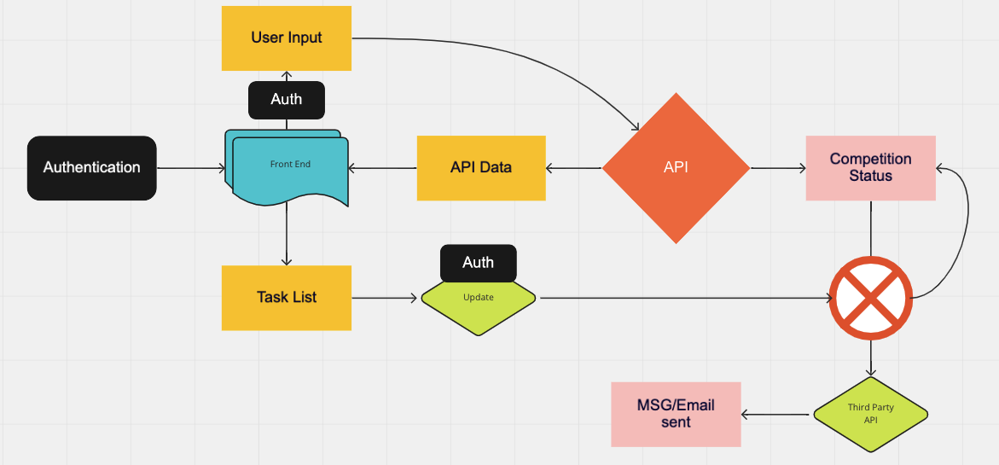

# [`TheG0ATS`](https://theg0ats.github.io/Project-Prep/)
> Code Fellows Python 401

## User Stories:
  - **User 1**: 
    - **User Story**: As a user, I want to play a fun and challenging puzzle game.
    - **Estimate**: Medium
    - **Featured Task**: 
      - User is presented with puzzles/levels.
      - Puzzles have a cleared/beaten state.
      - Users can then access more puzzles/levels.
    - **Acceptance Test**: 
      - Puzzles have an “uncleared” state.
      - Puzzles have a “cleared” state.

  - **User 2**: 
    - **User Story**: As a user, I want to be able to easily play cooperatively with a friend. 
    - **Estimate**: Medium
    - **Featured Task**: 
      - Host/join game room functionality
      - Game status is synced up between players via server
    - **Acceptance Test**: 
      - Player can host room
      - Other player can join hosted room
      - Positions and player statuses are consistently updated
      - Player can leave room without crashing

  - **User 3**: 
    - **User Story**: I'd like a responsive UX that is easy to navigate, and a visually appealing UI.
    - **Estimate**: Medium
    - **Featured Task**: 
      - App functionality is streamline
      - Minimal bugs
      - Clear instructions on how to use the app
    - **Acceptance Test**: 
      - Test and account for all possible game bugs.
      - Gameplay is smooth
      - Create an instructional section

  - **User 4**: 
    - **User Story**: As a user, I want to enjoy some type of in-game progression.  
    - **Estimate**: Medium
    - **Featured Task**: 
      - Some manner of level progression, or:
      - Some type of high-score list
      - Possibly unlockable features
    - **Acceptance Test**: 
      - Players can clear levels
      - New levels can be accessed after clearing prior levels

## [Software Requirements](requirements.md)

## Domain Modeling

