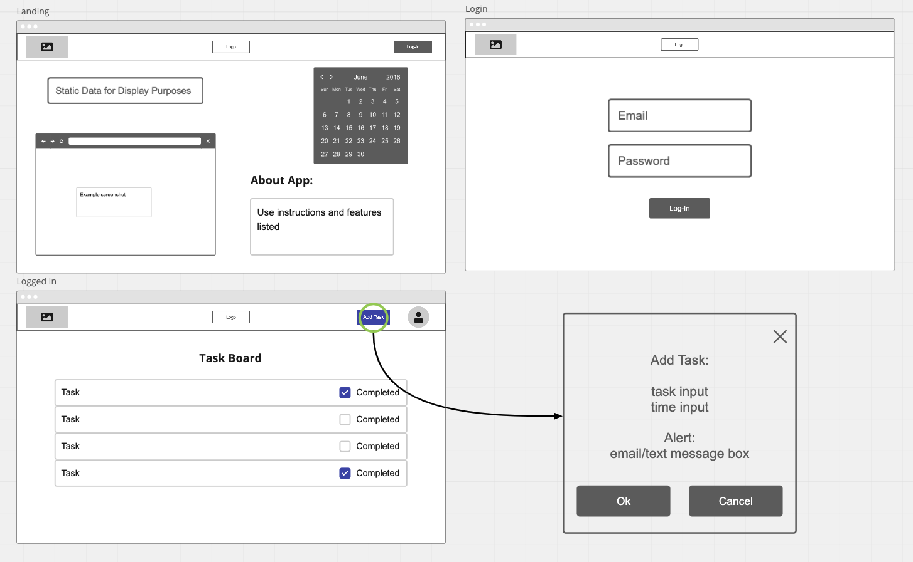

# [`TheG0ATS`](https://theg0ats.github.io/Project-Prep/)
> Code Fellows Python 401

## User Stories:
  - **User 1**: 
    - **User Story**: As a user, I want to be able to keep track of my tasks.
    - **Estimate**: Medium
    - **Featured Task**: 
      - User can login in and create tasks
    - **Acceptance Test**: 
      - Users tasks persist over time
      - User can view only their tasks

  - **User 2**: 
    - **User Story**: As a user, I want to set a time in which my tasts should be complete. 
    - **Estimate**: Medium
    - **Featured Task**: 
      - User can input task complete time per task item 
    - **Acceptance Test**: 
      - Item has ability store time complete
      - Item ability to tell time

  - **User 3**: 
    - **User Story**: I'd like a responsive UX that is easy to navigate, and a visually appealing UI.
    - **Estimate**: Medium
    - **Featured Task**: 
      - App functionality is streamline
      - Minimal bugs
      - Clear instructions on how to use the app
    - **Acceptance Test**: 
      - Test and account for all possible task bugs.
      - Smooth front end
      - Create an instructional section

  - **User 4**: 
    - **User Story**: As a user, I want my task to be timed and a penatly added if not complete.  
    - **Estimate**: Medium
    - **Featured Task**: 
      - If task not complete by time allowed send msg or email
    - **Acceptance Test**: 
      - Can add penatly to task
      - Can send image or or msg automatically to input email or phone number

## [Software Requirements](requirements.md)

## Wireframe

## Domain Modeling

 